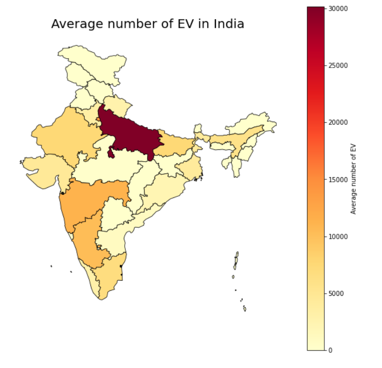
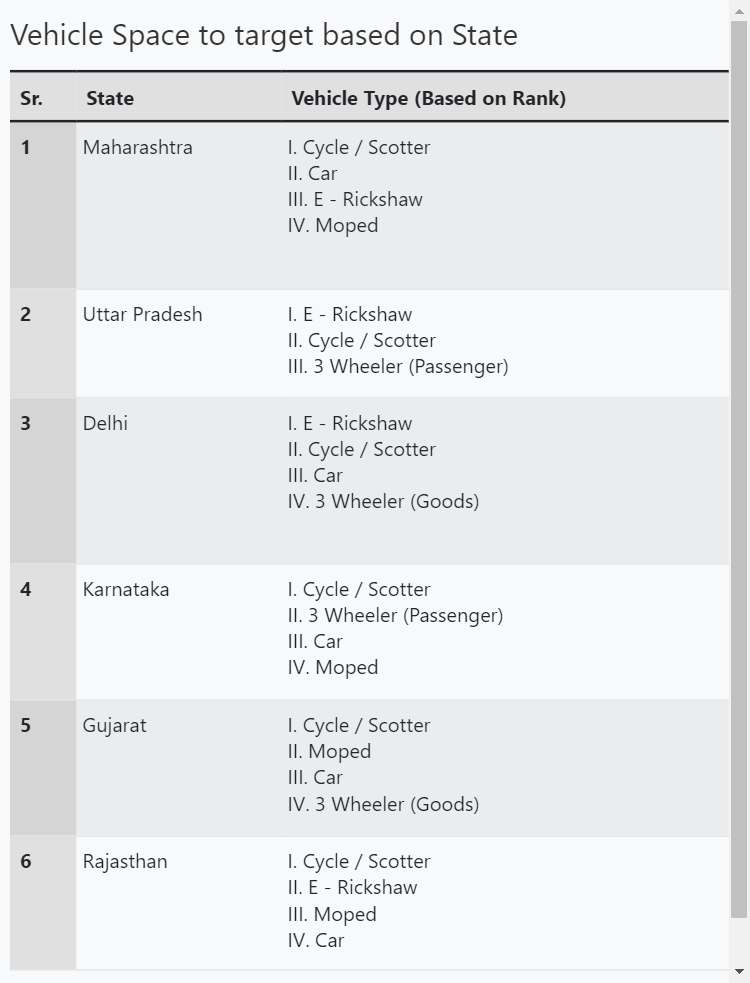
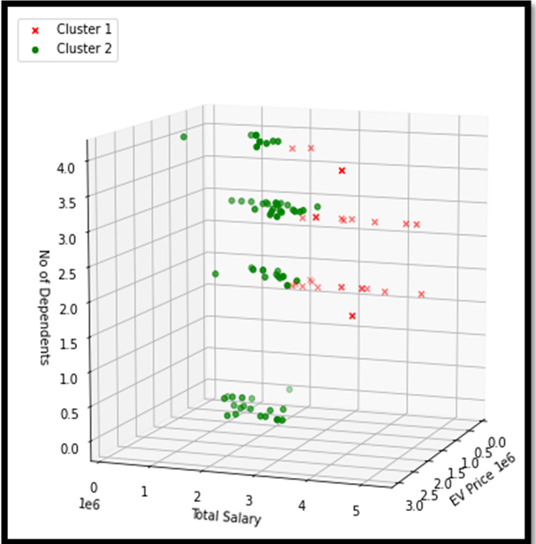
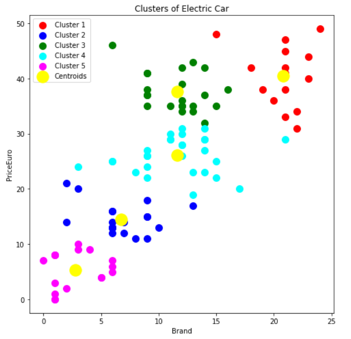

## Electric-Vehicle-Market-Segmentation

This is a team task where the job is to analyse the Electric Vehicle market in India using Segmentation analysis and come up with a feasible strategy to enter the market, targeting the segments most likely to use Electric vehicles. 

The following datsets are used to come up with segments to target:
1. Geographic & Vehicle Space Segmentation.
2. Behavourial Segmentation.
3. Vehicle Specification Segmentation.

##  Geographic & Vehicle Space Segmentation

In this part, we analyze the EV market across various states and then select the states to target and also the kind of EV to make.

Targetted States : Maharashtra, Uttar Pradesh, Karnataka, Gujarat, Delhi
Targetted Vehicle Space: Cycle, Car, Moped, E- Rickshaw

## Behavourial Segmentation

This segmentation talks about the marital status, age, salary and the preferred price of EV. Based on the clusters formed here we have 2 segments:

Segment 1 : These are wealthy people which can buy costly and premium Electric Vehicles.
Segment 2: These are people who woul opt for eco and budget friendly Electric Vehicles.

## Vehicle Specification Segmentation

This datset consists of vehcile specifications such as its range, efficiency, top speed and the type of drive. 

## Contributors 
[@Haseebae](https://github.com/Haseebae)
[@Pratiksha Rale](https://github.com/Pratiksha228)

## Some Visualizations:

